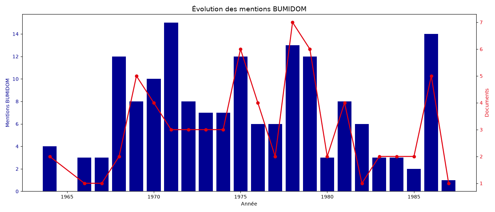
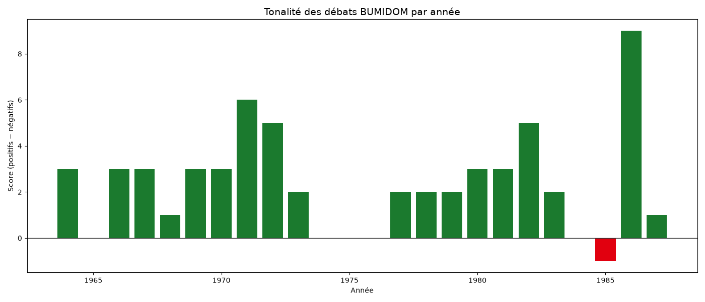
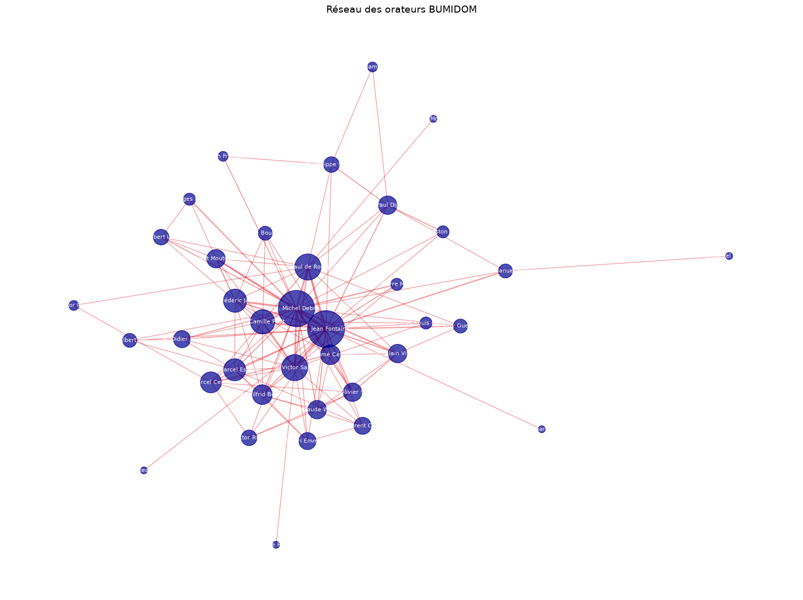

# Rapport final — BUMIDOM dans les débats parlementaires

*Généré le 26/09/2026 à 00:05*

---

## Synthèse générale

- **Documents analysés** : 71
- **Mentions totales de « BUMIDOM »** : 166
- **Orateurs uniques** : 838
- **Thèmes détectés** : 10

---

## 1. Chronologie

| Année | Documents | Mentions | CRI | QST |
|---|---|---|---|---|
| 1964 | 2 | 4 | 1 | 1 |
| 1966 | 1 | 3 | 1 | 0 |
| 1967 | 1 | 3 | 1 | 0 |
| 1968 | 2 | 12 | 1 | 0 |
| 1969 | 5 | 8 | 2 | 3 |
| 1970 | 4 | 10 | 4 | 0 |
| 1971 | 3 | 15 | 2 | 1 |
| 1972 | 3 | 8 | 2 | 1 |
| 1973 | 3 | 7 | 3 | 0 |
| 1974 | 3 | 7 | 2 | 1 |
| 1975 | 6 | 12 | 5 | 1 |
| 1976 | 4 | 6 | 4 | 0 |
| 1977 | 2 | 6 | 2 | 0 |
| 1978 | 7 | 13 | 7 | 0 |
| 1979 | 6 | 12 | 6 | 0 |
| 1980 | 2 | 3 | 0 | 2 |
| 1981 | 4 | 8 | 3 | 1 |
| 1982 | 1 | 6 | 1 | 0 |
| 1983 | 2 | 3 | 2 | 0 |
| 1984 | 2 | 3 | 2 | 0 |
| 1985 | 2 | 2 | 2 | 0 |
| 1986 | 5 | 14 | 5 | 0 |
| 1987 | 1 | 1 | 1 | 0 |

---

## 2. Top 30 mots associés

| # | Mot | Occ. |
|---|---|---|
| 1 | outre | 161 |
| 2 | départements | 119 |
| 3 | métropole | 115 |
| 4 | emploi | 86 |
| 5 | etat | 58 |
| 6 | réunion | 56 |
| 7 | migration | 55 |
| 8 | migrations | 54 |
| 9 | jeunes | 51 |
| 10 | crédits | 50 |
| 11 | formation | 46 |
| 12 | migrants | 44 |
| 13 | ministre | 44 |
| 14 | nationale | 42 |
| 15 | développement | 38 |
| 16 | professionnelle | 37 |
| 17 | travailleurs | 37 |
| 18 | bureau | 34 |
| 19 | soit | 33 |
| 20 | travail | 32 |
| 21 | france | 31 |
| 22 | même | 31 |
| 23 | francs | 30 |
| 24 | agence | 30 |
| 25 | budget | 29 |
| 26 | nombre | 29 |
| 27 | demande | 27 |
| 28 | réunionnais | 26 |
| 29 | voyage | 26 |
| 30 | problème | 26 |

---

## 3. Top orateurs

| Orateur | Mentions | Docs | Thème 1 | Thème 2 |
|---|---|---|---|---|
| M. Jean Fontaine | 219 | 23 | budget (4542) | migration (3861) |
| M. Michel Debré | 179 | 27 | migration (4633) | budget (4064) |
| M. Henri Emmanuelli | 104 | 4 | migration (852) | budget (619) |
| M. Victor Sablé | 96 | 13 | migration (3339) | budget (2761) |
| M. Olivier Stirn | 90 | 8 | migration (1566) | emploi (1394) |
| M. Paul Dijoud | 81 | 6 | budget (1013) | migration (817) |
| M. Emmanuel Hamel | 79 | 14 | budget (2482) | emploi (2136) |
| M. Jean-Paul de Rocca Serra | 77 | 17 | migration (3823) | budget (3706) |
| M. Didier Julia | 73 | 5 | migration (950) | budget (673) |
| M. Robert-André Vivien | 63 | 5 | migration (1098) | budget (693) |
| M. Aimé Césaire | 62 | 8 | migration (1686) | budget (1280) |
| M. Alain Vivien | 61 | 7 | budget (1500) | migration (1337) |
| M. Frédéric Jalton | 60 | 10 | migration (1970) | budget (1703) |
| M. Robert Le Foll | 56 | 5 | migration (981) | budget (439) |
| M. Ernest Moutoussamy | 54 | 8 | migration (1544) | budget (1241) |
| M. Jean-Paul Virapoullé | 50 | 5 | migration (842) | emploi (355) |
| M. Pierre Mauger | 48 | 9 | budget (1486) | emploi (1041) |
| M. Georges Lemoine | 47 | 5 | migration (692) | budget (550) |
| M. Joseph Franceschi | 46 | 5 | emploi (621) | migration (541) |
| M. Camille Petit | 42 | 11 | migration (2373) | budget (2333) |
| M. Pierre Mazeaud | 42 | 2 | migration (237) | budget (237) |
| M. Bernard Marie | 41 | 3 | budget (643) | migration (277) |
| M. Albert Pen | 41 | 4 | migration (836) | budget (776) |
| M. Robert Montdargent | 39 | 4 | budget (712) | migration (476) |
| M. Antoine Gissinger | 38 | 6 | emploi (1600) | migration (568) |
| M. Guy Guermeur | 36 | 6 | budget (1381) | migration (711) |
| M. Wilfrid Bertile | 36 | 4 | migration (877) | budget (787) |
| M. Guy Ducoloné | 35 | 8 | emploi (1123) | budget (1096) |
| M. Philippe Séguin | 33 | 5 | budget (969) | emploi (686) |
| M. Marcel Esdras | 33 | 4 | migration (836) | budget (776) |

---

## 4. Par législature

| Lég. | Docs | Mentions | Thème dominant | Orateur dominant |
|---|---|---|---|---|
| 2 | 3 | 7 | migration | M. Pierre Bas |
| 3 | 1 | 3 | migration | M. Victor Sablé |
| 4 | 17 | 53 | emploi | M. Bernard Marie |
| 5 | 18 | 38 | budget | M. Olivier Stirn |
| 6 | 15 | 28 | budget | M. Paul Dijoud |
| 7 | 9 | 20 | budget | M. Henri Emmanuelli |
| 8 | 8 | 17 | migration | M. Michel Debré |

---

## 5. Tonalité par année

| Année | + | − | = | Score |
|---|---|---|---|---|
| 1964 | 3 | 0 | 1 | 3 |
| 1966 | 3 | 0 | 0 | 3 |
| 1967 | 3 | 0 | 0 | 3 |
| 1968 | 6 | 5 | 1 | 1 |
| 1969 | 4 | 1 | 3 | 3 |
| 1970 | 5 | 2 | 3 | 3 |
| 1971 | 8 | 2 | 5 | 6 |
| 1972 | 5 | 0 | 3 | 5 |
| 1973 | 3 | 1 | 3 | 2 |
| 1974 | 2 | 2 | 3 | 0 |
| 1975 | 5 | 5 | 2 | 0 |
| 1976 | 3 | 3 | 0 | 0 |
| 1977 | 4 | 2 | 0 | 2 |
| 1978 | 6 | 4 | 3 | 2 |
| 1979 | 4 | 2 | 6 | 2 |
| 1980 | 3 | 0 | 0 | 3 |
| 1981 | 4 | 1 | 3 | 3 |
| 1982 | 5 | 0 | 1 | 5 |
| 1983 | 2 | 0 | 1 | 2 |
| 1984 | 1 | 1 | 1 | 0 |
| 1985 | 0 | 1 | 1 | -1 |
| 1986 | 11 | 2 | 1 | 9 |
| 1987 | 1 | 0 | 0 | 1 |

---

## 6. Thèmes globaux

| Thème | Occurrences |
|---|---|
| budget | 10686 |
| emploi | 10469 |
| migration | 9594 |
| antilles | 3319 |
| formation | 3262 |
| transport | 2812 |
| reunion | 2017 |
| insertion | 1464 |
| logement | 1460 |
| racisme | 1137 |

---

## 7. Graphiques

### analyse_chrono.png

### analyse_sentiment.png

### analyse_reseau.png

---

## 8. Ressources produites

- `analyse_chrono.csv` / `.png` — Évolution année par année
- `analyse_cooccurrences.csv` — Top 100 mots associés
- `orateurs_profils.csv` — Profil des 30 top orateurs
- `fiches_orateurs/*.md` — Une fiche par orateur
- `analyse_legislatures.csv` — Comparaison par législature
- `analyse_sentiment.csv` / `.png` — Tonalité par année
- `analyse_reseau.csv` / `.png` — Réseau de cooccurrence
- `bumidom.db` — Base SQLite

## 9. Pour aller plus loin

- Consulter `dashboard_enrichi.html` (dashboard interactif)
- Explorer `bumidom.db` avec DB Browser for SQLite
- Utiliser `corpus/` dans Obsidian pour analyse textuelle
- Consulter `fiches_orateurs/` pour des biographies
